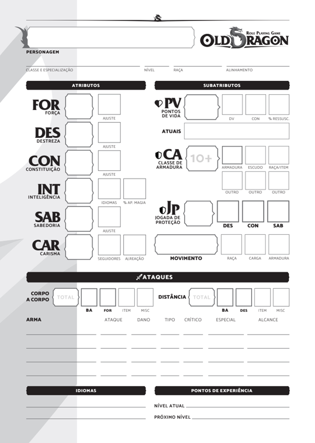
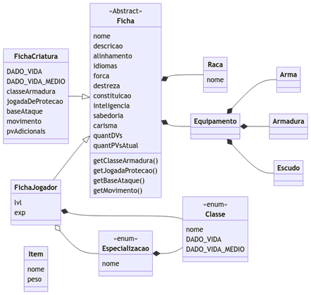

# ToolsForRPG_Panpalianos
## Utilitário para Old Dragon
O software Tools For RPG – Panpalianos é um projeto pessoal que serve como utilitário para o Sistema de RPG de Mesa Old Dragon, baseando-se principalmente no livro básico da 1ª edição.

## 1. Requisitos
Esse tópico tem como fim reunir os requisitos funcionais, não funcionais e regras de negócio:
- RF: Requisito Funcional
- RNF: Requisito Não Funcional

|Requisitos Funcionais|Descrição|
|-|-|
|RF01 - Manter fichas                       |Se terá a opção de cadastrar, consultar, atualizar e excluir fichas.|
|RF02 - Opções de criação de ficha          |Será possível criar fichas genéricas e de jogadores|
|RF03 - Customização da criação das fichas  |Será possível criar fichas com atributos aleatórios|
|RF04 - Geração de tabela de upgrade        |Será possível gerar uma tabela de upgrade de preço de equipamente|
|RF05 - Leitura de csv de fichas            |O sistema deverá ser capaz de ler um arquivo csv de fichas|
|RF06 - Gerenciar iniciativas de combate    |O sistema deverá ser capaz de gerenciar as iniciativas num combate qualquer, levando em conta todas as criaturas presentes no combate, como jogadores e monstros.|
|RF07 - Geração de estatísticas das fichas  |O sistema deverá ser capaz de calcular a média, mínimo e máximo de um conjunto qualquer de fichas|

|Requisitos Não Funcionais|Descrição|
|-|-|
|RNF01 - Linguagem de programação           |O sistema será implementado em Java.|
|RNF02 – Acessibilidade                     |O sistema será feito para que seja facilmente acessível pelo usuário, sendo leve e eficiente.|

## 2. Entidades

|Nome da entidade|Descrição|
|-|-|
|Ficha de criatura        |Uma ficha genérica, que representa uma criatura qualquer.|
|Ficha de jogador         |Uma ficha de personagem de jogador, possuindo classe, niveis e habilidades que a diferenciam de uma ficha de criatura.|

# Anexos
## Ficha de Old Dragon, Frente e Verso
         

## Diagrama de classe

